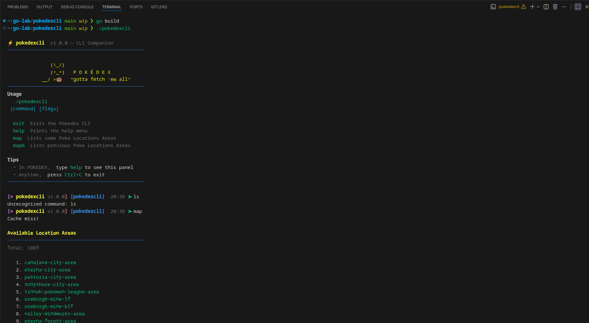
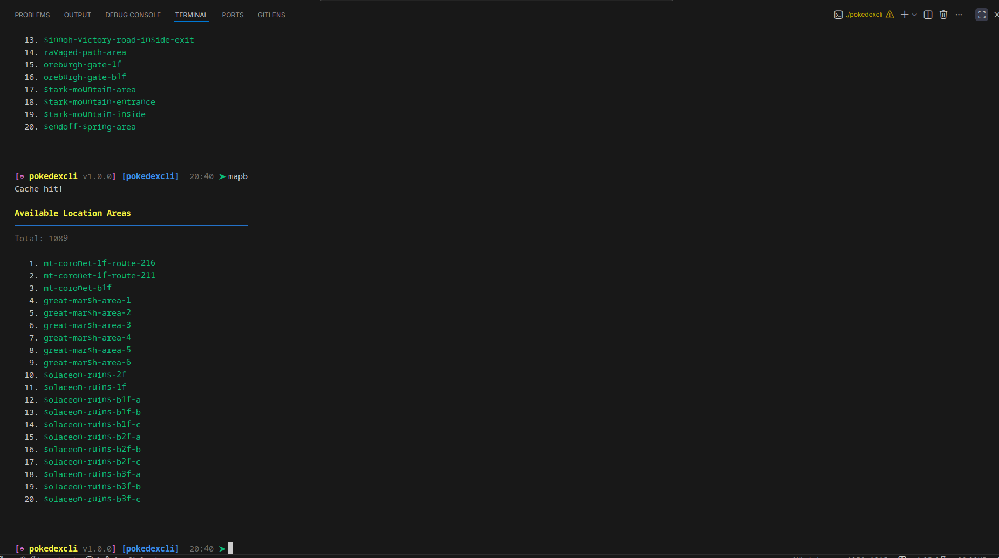
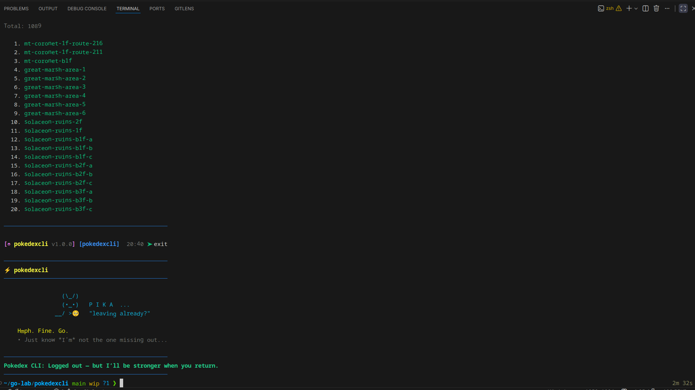

# pokedexcli

A lightweight Pokémon-themed REPL that pages through location areas from [PokeAPI](https://pokeapi.co/) with a colorful prompt, simple navigation commands, and a built-in response cache to keep repeated calls snappy.

## Features
- REPL prompt with branch/time context and ANSI color (respecting `NO_COLOR`).
- `map` / `mapb` commands page forward/backward through location areas from PokeAPI.
- Hour-long in-memory cache for API responses (see `internal/pokecache`).
- Helpful startup panel (`help`) and a playful exit screen (`exit`).
- Small, tested helper utilities (`CleanInput`, cache).

## Getting Started
Prereqs: Go (matching `go.mod`; internet access for PokeAPI calls).

```bash
git clone https://github.com/KhaledSaiidi/go-lab/pokedexcli.git
cd pokedexcli

# Run
go run .

# Or build a binary
go build -o pokedexcli .
./pokedexcli
```

## Commands
| Command | Description |
| --- | --- |
| `help` | Show the Pikachu help panel and command list. |
| `map` | Fetch the next page of location areas. Stores pagination cursors. |
| `mapb` | Fetch the previous page (if available). |
| `exit` | Quit with a farewell. |

Navigation state (next/prev URLs) and cache are kept for the session. Running `map` after `mapb` resumes forward paging from the remembered URL.

## Screenshots




## How It Works
- PokeAPI client: `internal/pokeapi` builds URLs (default `/location-area`) and respects pagination links from responses.
- Caching: `internal/pokecache` stores raw responses with timestamps; a background reaper clears entries older than the configured interval (default `time.Hour` in `main.go`).
- Prompt styling: `repl.go`/`command_help.go` define ANSI color helpers; colors are disabled when `NO_COLOR` is set.

### Project Structure
- `main.go` – wires the client, config, and REPL start.
- `repl.go` – prompt rendering, command registry, input cleaning.
- `command_*.go` – individual command handlers.
- `internal/pokeapi` – PokeAPI HTTP client and response types.
- `internal/pokecache` – TTL cache with background reaping.

## Development
- Run tests: `go test ./...` (no network calls in tests).
- Lint/format: `go fmt ./...` before committing.
- Troubleshooting: if API calls feel slow, check network access; if outputs look odd, set `NO_COLOR=1` to disable ANSI codes.
