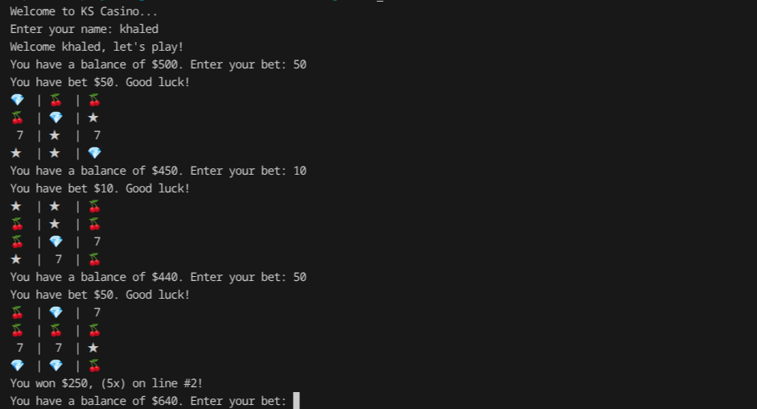
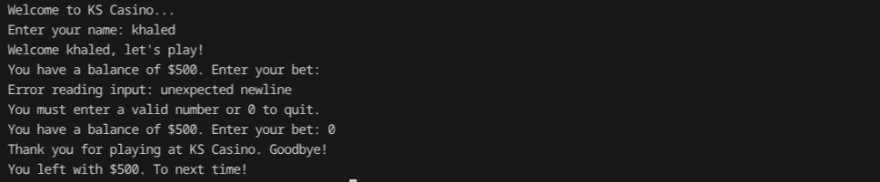

# slot-machine

A tiny casino-style slot machine game for the terminal. Spin emoji reels, place bets, and see your balance change based on simple payout multipliers.

## Features
- 3x4 reel display with emoji symbols aligned in the terminal.
- Starting balance of $500 with per-spin betting and win payouts.
- Line-based wins across each row with configurable multipliers.
- Friendly prompts for name, betting, and exit.

## Getting Started
Prereqs: Go (matching `go.mod`).

```bash
git clone https://github.com/KhaledSaiidi/go-lab/slot-machine.git
cd slot-machine

# Run
go run .

# Or build a binary
go build -o slot-machine .
./slot-machine
```

## How To Play
1. Enter your name.
2. Place a bet (or 0 to quit).
3. Watch the reels spin and check the winnings line by line.

Payouts are based on a full row match:
- `7` → 20x
- `💎` → 8x
- `🍒` → 5x
- `★` → 2x

## Screenshots



## How It Works
- Reels: `SpinReels` expands the symbol distribution into a weighted reel slice.
- Spin: `GetSpin` picks unique symbols per column to form a 3x4 grid.
- Display: `PrintSpin` uses `go-runewidth` to keep emoji columns aligned.
- Winnings: `checkWin` scans each row for full matches and applies multipliers.

### Project Structure
- `main.go` – game loop, payouts, balance management.
- `sping.go` – reel generation and spin logic.
- `ui.go` – aligned terminal rendering.
- `utils.go` – name/bet prompts and input validation.
- `assets/` – screenshots.

## Development
- Run tests: `go test ./...`
- Lint/format: `go fmt ./...` before committing.
